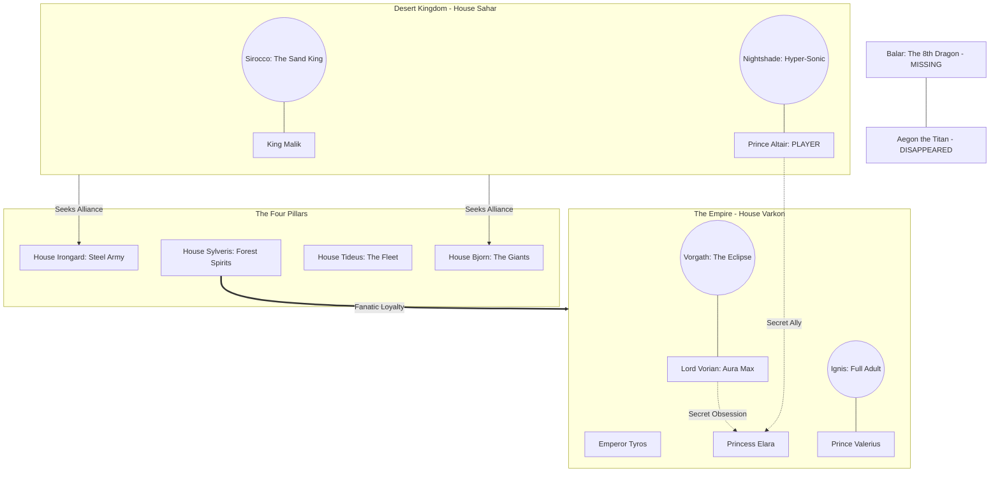

# Legacy of Emperor: Under the Draconic Wing

**Project Overview:** A High-Aura Action RPG developed in Unreal Engine 5 and Blender.

---

## 1. The Narrative Lore

### The Backstory

Thirty years ago, **Aegon the Titan** (The Conqueror) vanished during a flight over the Frozen North with **Balar**, the 8th Dragon—a beast the size of three cities. His son, **Tyros**, took the throne, ruling through fear with the remaining five dragons.

### The Conflict

At the "Feast of the Spire," Emperor Tyros is poisoned. **Lord Vorian** (The Imperial Ward) seizes control, framing **House Sahar** (The Desert Kingdom) for the crime. As **Prince Altair**, you must escape the capital with your dragon, **Nightshade**, and unite the fractured kingdoms to stop Vorian’s "Shadow Fire."

---

## 2. World Hierarchy & Alliances

The following diagram illustrates the power structure and the relationships between the 6 Kingdoms and their respective dragons.

